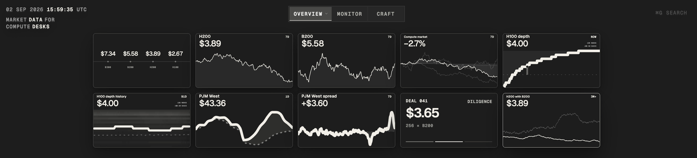

# Desk



The workspace for compute desks.

Desk is the workspace where you explore compute market data, create market
views, monitor and share. Built for anyone building or running a compute desk.

[Open Desk](https://desk.adamsioud.com)

The idea behind Desk is that you can compose what you want to see: compute market data, power data, your deals, or anything else relevant to your work. It is a workspace with the basic pieces to build your own compute desk. A simple Bloomberg-esque terminal, just for compute, just sleeker.

See [The Compute Bazaar](https://github.com/gustofied/the-compute-bazaar) for
my wider work on compute markets.

## Run locally

```bash
npm install
npm run build
npm run dev
```

Open <http://localhost:4173>.
