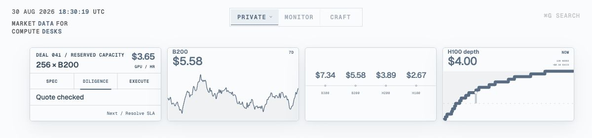

# Desk

Market data for compute desks.

[Open Desk](https://desk.adamsioud.com)



Desk is a browser workspace for compute market views. Catalog organizes views,
Monitor opens one for inspection, and Craft composes and saves a view. Share
links preserve the view's data, range, and chart mode. Their artwork uses the
sender's appearance; returning visitors keep their saved Desk appearance.

## Workspace

- **Catalog** arranges saved and preset views into named galleries that can be reordered.
- **Monitor** opens one view for hovering, zooming, and closer reading.
- **Craft** keeps that view in place while exposing its data and presentation
  controls.

## Included views

- Hourly H100, H200, B200, and B300 price history
- Current accelerator price comparison
- H100 market depth as a current capacity curve or depth history
- Deal 041 as a compact private market workflow
- Token Price Index as a comparison layer
- Price, return, and two-GPU return-spread comparisons
- Four palettes with light and dark themes

The included data is a deterministic product showcase. It is designed to
exercise the complete workspace and sharing system.

## Run locally

```bash
npm install
npm run build
npm run dev
```

Open <http://localhost:4173>.

## Working with Desk

- Switch Catalogs from the Catalog segment and reorder views by dragging them.
- Open a view in Monitor, then move to Craft when its data or presentation
  needs changing.
- Save a Craft composition to the active Catalog. Saved views remain in the
  current browser.
- Use **Command G** to find views and controls, change the display, or copy an
  exact view link.
- Shared links keep the selected composition. Their social artwork matches the
  sender, while a returning visitor's saved Desk appearance takes priority.
- Keyboard navigation, reduced motion, responsive layouts, and chart inspection
  are supported throughout.

## View system

[`src/card-registry.js`](src/card-registry.js) is the source of truth for view
metadata, renderers, data layers, ranges, palettes, defaults, and share paths.
The browser and preview build both read from it, so the page and shared artwork
stay aligned.

Saved views use a versioned `CardDocument` that keeps the renderer and every
registered state field together. Catalogs store references to those documents,
which lets the same view appear in multiple arrangements without copying its
data.

Internal `card` identifiers remain in filenames, URLs, and stored documents so
existing links and browser saves continue to work.

## Data and builds

Source records live under `api/dashboard-snapshots/`.

Monitor includes a compact Desk API panel with a view-aware Desk CLI command
and a DataFusion SQL query. The build writes flat, versioned JSON tables for
the public views:

- `data/v1/compute-prices.json`
- `data/v1/accelerator-prices.json`
- `data/v1/h100-market-depth.json`

The SQL targets `datafusion-cli` 53 or newer so the published JSON arrays can
be read directly as external tables. Embedded DataFusion clients need an HTTPS
object store registered by their host application.

The private Deal workflow remains view-only and has no public data export.

## Desk CLI

Desk CLI syncs the rows behind a view into a local JSON table. It requires
Node.js 22 or newer.

```bash
mkdir -p "$HOME/.local/bin"
curl -fsSL https://desk.adamsioud.com/cli/desk \
  -o "$HOME/.local/bin/desk"
chmod +x "$HOME/.local/bin/desk"
```

Add `$HOME/.local/bin` to `PATH`, then sync a view:

```bash
desk \
  data sync \
  compute-prices \
  --series=H200,TPI \
  --range=7d
```

`desk --help` lists the price, snapshot, and market-depth datasets together
with their available filters. Use `--stdout` to stream rows or `--output` to
choose a file.

```bash
npm run check:data       # validate the included market run
npm run generate:data    # rebuild showcase histories and market depth
npm run build:data       # write compact browser data
npm run build:previews   # render exact social artwork
npm run build:site       # assemble the GitHub Pages artifact
```

`npm run refresh:data` validates a complete, non-regressing replacement set
before installing it. The `Refresh Desk market data` workflow is available for
manual refresh and can be scheduled when the configured source has a reliable
freshness guarantee.

The market depth scenario follows the availability ladder described in
[Feeling the Compute](https://www.adamsioud.com/exemplars/compute/feeling_the_compute.html):
capacity accumulates as the acceptable hourly price rises.

`npm run build` rebuilds browser data, exact previews, local fonts, and
`desk.js`. The generated Pages matrix is assembled without being committed to
Git history.

## Project map

- `index.html` contains the semantic workspace markup.
- `src/` contains the registry, state, view models, and renderers.
- `scripts/` validates data and builds previews and Pages output.
- `styles/` contains the workspace, view, control, and page styles.

Edit source files and run `npm run build`. `desk.js` is generated.
