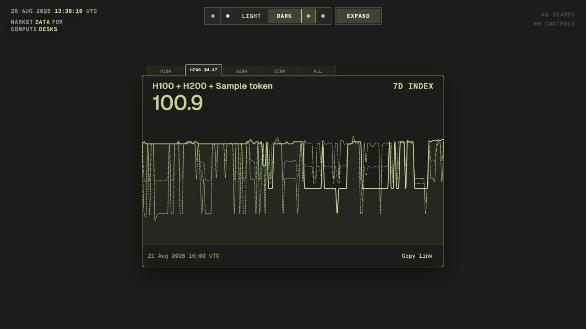

# Desk

Market data for compute desks.

Desk turns market series into focused cards that can be explored, compared,
and shared. Every choice is stored in the link, including the card,
layers, view, range, palette, and theme.

Website: <https://desk.adamsioud.com>



## What is here

- Hourly H100, H200, B200, and B300 prices
- Price view for series with the same unit
- Index view for comparing different kinds of data from a common starting point
- A clearly marked sample Compute Token series for trying mixed comparisons
- Four color palettes with light and dark themes
- Clean card and gallery views
- Exact links for editable card compositions
- Keyboard access, reduced motion, responsive layouts, and chart inspection

The sample token series is generated from H100 and H200 price changes. It is an
illustrative index, not a quoted token price.

## Run locally

```bash
npm install
npm run build
npm run dev
```

Open <http://localhost:4173>.

## Working with a card

The tabs above the card open one GPU at a time. The quiet row below the chart
controls its value view, comparison, and sharing.

- Open Compare to add or remove data layers.
- Adding the sample token switches the card to Index automatically.
- Share copies the exact card link. Expand returns to the editable view.
- Shared links use social artwork that matches the selected layers, value view,
  range, palette, and light or dark theme.
- Press **Command G** to find cards, layers, views, ranges, and settings.
- Press **Command H** to hide or show the display controls.

## Card registry

[`src/card-registry.js`](src/card-registry.js) is the source of truth for card
metadata, data layers, value views, ranges, palettes, defaults, and share paths.
The browser and the preview build both read from it, so labels and colors do not
drift apart.

New card types should register their metadata there and keep their renderer
explicit. The registry describes a card; it does not try to turn every chart
into one generic component.

## Data build

The source records live under `api/dashboard-snapshots/`. Running
`npm run build:data` writes one compact browser file to
`data/gpu-price-index.json`. The page loads that file once and lets the browser
and CDN cache it normally.

`npm run build` always rebuilds the compact data, exact share previews, local
fonts, and browser bundle. `npm run build:site` assembles the clean GitHub Pages
artifact in `_site`.

## Project shape

- `index.html` contains the semantic page and card markup.
- `src/main.js` owns the current GPU card renderer and interactions.
- `src/card-registry.js` defines cards, layers, views, ranges, and palettes.
- `src/card-presentation.js` creates and normalizes exact card links.
- `src/command-palette.js` provides the searchable resource index.
- `scripts/build-runtime-data.mjs` creates the compact data file.
- `scripts/build-card-previews.mjs` creates social images and share routes.
- `scripts/build-site.mjs` assembles the deployment without committing the full
  preview matrix.
- `styles/` contains the card, workspace, control, and page styles.

Edit the source files and run `npm run build`. `desk.js` is generated. Exact
published routes, preview images, and local font files are generated for local
use and for the Pages deployment without being added to Git history.
