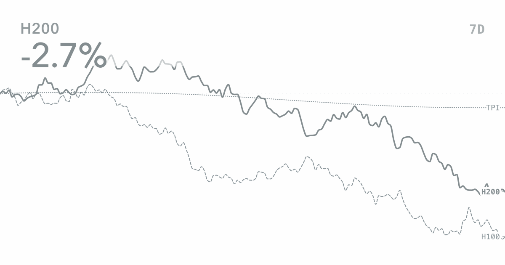

# Desk

Market data for compute desks.

Desk turns market series into focused views that can be explored, compared,
and shared. Every choice is stored in the link, including the view,
layers, chart mode, range, palette, and theme.

Website: <https://desk.adamsioud.com>



## What is here

- Hourly H100, H200, B200, and B300 prices
- A focused price-history view and a current-price bar view
- H100 market depth with a current executable curve and daily depth history
- Price scale for series with the same unit
- Index scale for comparing different kinds of data from a common starting point
- Token Price Index for mixed comparisons
- Four color palettes with light and dark themes
- Clean single-view and gallery layouts
- Exact links for editable view compositions
- Keyboard access, reduced motion, responsive layouts, and chart inspection

## Run locally

```bash
npm install
npm run build
npm run dev
```

Open <http://localhost:4173>.

## Catalog, Monitor, and Craft

Catalog holds clean views in switchable, named arrangements. **All views** is
the complete source; a named Catalog keeps its own selected views and order.
Monitor opens one composition for interactive reading. Craft keeps that same
chart in place and adds the controls for changing its data.

- Use the tight **Catalog**, **Monitor**, and **Craft** switcher at the top. In
  the gallery, the active Catalog name occupies the Catalog segment; select it
  to switch arrangements.
- GPU tabs switch views inside Catalog. **All** opens the gallery.
- The Catalog menu switches, creates, renames, or deletes arrangements.
  **Views** opens the view chooser. The same view can appear in more than one
  named Catalog without copying its data.
- Drag views to set a different order in each named Catalog. Deleting a named
  Catalog never deletes its views from **All views**.
- Monitor keeps one composition fixed for reading, hovering, zooming, and changing the chart mode.
- Opening Craft from Catalog starts a new composition. If unfinished work is
  waiting, Craft resumes it. Opening Craft from Monitor edits the composition
  already on screen.
- Craft keeps the chart central while its Data drawer selects the main series,
  comparisons, and Price or Index scale.
- **Save** names a new composition and returns it to the active Catalog. Later
  changes use **Update**, while an unchanged view reads **Saved**.
  Saved items keep their data layers, range, palette, and light or dark theme.
  An unfinished draft remains available in the current browser tab until it is
  saved or replaced with a new composition.
- GPU data uses hourly prices. Adding the Token Price Index compares movement from a
  common starting point.
- Market depth uses **Now** for the current cumulative capacity curve and
  **History** for capacity by price through time. Both use the selected node
  target to show the executable clearing price against the benchmark.
- Catalog thumbnails match the current Desk colors by default. Use **Command G**
  to show each view's saved colors instead. Opening or sharing a view always
  keeps that view's own palette and light or dark theme.
- Use **Command G** and choose **Copy view link** to share the active view.
- Shared links use social artwork that matches the selected layers, range,
  target, palette, and light or dark theme.
- Press **Command G** to find views, layers, ranges, settings, and to show the display controls when needed.

## View registry

[`src/card-registry.js`](src/card-registry.js) is the source of truth for view
metadata, data layers, ranges, palettes, defaults, and share paths.
The browser and the preview build both read from it, so labels and colors do not
drift apart.

New view types should register their metadata there and keep their renderer
explicit. The registry describes a view; it does not try to turn every chart
into one generic component.

Saved views use a versioned `CardDocument`. That keeps the renderer and every
registered state field together, including market-depth targets, while the
Catalog can safely migrate older local saves.

Internal `card` identifiers remain in filenames, URLs, and stored documents so
existing links and saved views continue to work.

## Data build

The source records live under `api/dashboard-snapshots/`. Running
`npm run generate:data` rebuilds the deterministic showcase market and
`npm run build:data` writes compact browser files for price history and market
depth, plus `data/manifest.json` with their revisions. The page loads these
files once and lets the browser and CDN cache them normally.

`npm run check:data` validates the four checked-in source snapshots as one
coherent Compute Bazaar run. `npm run refresh:data` first downloads and
validates a complete, non-regressing replacement set, then installs it from a
staging directory. The default public source is
`https://www.adamsioud.com/api/dashboard-snapshots`. Set the
`DESK_SNAPSHOT_BASE_URL` repository variable to point the workflow at the live
Compute Bazaar public feed, and set the `DESK_SNAPSHOT_TOKEN` secret only if
that feed requires a bearer token. Set
`DESK_MAX_SNAPSHOT_AGE_HOURS` once the live feed has an enforceable freshness
SLA.

The `Refresh Desk market data` workflow checks for a validated Compute Bazaar
run every hour. It rebuilds runtime data and social previews only when the
source changes, commits only the approved generated paths, then explicitly
starts the Pages deployment for that exact commit.

The market-depth scenario follows the availability ladder described in
[Feeling the Compute](https://www.adamsioud.com/exemplars/compute/feeling_the_compute.html):
capacity accumulates as the acceptable hourly price rises.

`npm run build` always rebuilds the compact data, exact share previews, local
fonts, and browser bundle. `npm run build:site` assembles the clean GitHub Pages
artifact in `_site`.

## Project shape

- `index.html` contains the semantic page and view markup.
- `src/main.js` owns the view workspace and interactions.
- `src/gpu-price-bar-model.js` creates the current-price ranking.
- `src/gpu-price-bar-presentation.js` renders the bar view in the page and
  share images.
- `src/gpu-market-depth-model.js` turns depth snapshots into availability
  shelves, benchmark capacity, clearing prices, and history.
- `src/gpu-market-depth-presentation.js` renders the current curve and depth
  history in Catalog, Monitor, Craft, and shared images.
- `src/card-document.js` defines the saved-view contract.
- `src/card-registry.js` defines views, layers, chart modes, ranges, and palettes.
- `src/card-presentation.js` creates and normalizes exact view links.
- `src/craft-composition.js` normalizes Craft changes to main data, layers, and chart mode.
- `src/saved-catalog.js` stores named Craft compositions for the local Catalog.
- `src/catalog-collections.js` stores named arrangements of view references and
  their independent order.
- `src/command-palette.js` provides the searchable resource index.
- `scripts/build-runtime-data.mjs` creates the compact data file.
- `scripts/generate-showcase-market.mjs` creates the showcase histories.
- `scripts/generate-market-depth.mjs` creates the H100 depth scenario.
- `scripts/build-card-previews.mjs` creates social images and share routes.
- `scripts/build-site.mjs` assembles the deployment without committing the full
  preview matrix.
- `styles/` contains the view, workspace, control, and page styles.

Edit the source files and run `npm run build`. `desk.js` is generated. Exact
published routes, preview images, and local font files are generated for local
use and for the Pages deployment without being added to Git history.
